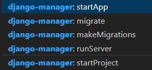

# django-manager

this is a django manager command just `ctrl+shift+p` and input `django-manager`

## Warning

**!!!** this extension need your default terminal to be `powershell`.

## Features

### basic

startproject
startapp
makemigrations
migrate
runserver

## TODO

- [x] runserver: with custom ports
- [x] startproject: create project in current folder
- [x] create app with `static` , `templates` and `urls.py` in respective folder
